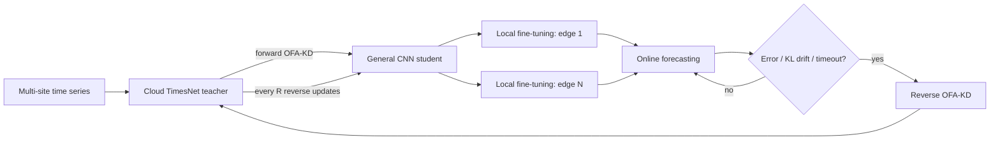

# CE-BiD: Cloud-Edge Collaborative Time-Series Forecasting

[中文说明](README_zh.md) · [Reproduction guide](docs/REPRODUCIBILITY.md)

CE-BiD is a research implementation of online cloud-edge forecasting for photovoltaic generation and charging demand. A high-capacity **TimesNet** learns multi-site temporal patterns in the cloud; compact **1D-CNN** models run at edge sites. Knowledge moves in both directions through regression-adapted **One-for-All knowledge distillation (OFA-KD)**, while error, distribution-drift, and timeout triggers avoid updating at every inference step.

The code is adapted from [THUML Time-Series-Library](https://github.com/thuml/Time-Series-Library). The cloud-edge orchestration, compact CNN, forward/reverse distillation, OFA regression objectives, event-triggered simulator, and experimental workflows are project-specific additions.

## System overview



The implementation has four stages:

1. Train a TimesNet teacher on the merged multi-site series.
2. Distill it into one architecture-compatible general CNN, with hard labels, soft teacher targets, and optional stage-level OFA projectors.
3. Fine-tune a copy of the CNN at each edge site.
4. During online simulation, trigger reverse distillation only after forecast degradation, histogram-based KL drift, or a timeout; periodically send the refreshed cloud knowledge back to the edges.

## Verified experimental results

The following values are transcribed from the retained experiment reports and paper draft; they are not newly generated during repository cleanup.

| Dataset | Method | MAE ↓ | MSE ↓ | RMSE ↓ | R² ↑ | Corr ↑ |
|---|---|---:|---:|---:|---:|---:|
| PVOD | Best baseline by MSE (TimeXer) | 0.2735 | 0.2786 | 0.5279 | 0.8424 | 0.9186 |
| PVOD | **CE-BiD** | 0.3027 | **0.2701** | **0.5190** | **0.8472** | **0.9204** |
| ST-EVCDP | Best baseline by MSE (TimeXer) | 0.3025 | 0.2986 | 0.5464 | 0.7598 | 0.8723 |
| ST-EVCDP | **CE-BiD** | **0.2863** | **0.2506** | **0.5001** | **0.7864** | **0.8867** |

This corresponds to a reported MSE reduction of **3.05% on PVOD** and **16.08% on ST-EVCDP** versus the best MSE baseline. On PVOD, TimeXer still has the lower MAE; CE-BiD leads on the other four listed metrics. The complete values and ablations are versioned in [`docs/results`](docs/results).

The retained PVOD online report contains 167 inference steps and 32 triggered updates (19.2%): 9 error, 5 drift, and 18 timeout triggers. Its across-edge average is MSE 0.2701, MAE 0.3027, R² 0.8472, and Corr 0.9204.

## Repository layout

```text
data_provider/     validated CSV loading, chronological splitting, scaling
exp/               training, forward KD, local fine-tuning, reverse KD, simulator
layers/             TimesNet blocks plus OFA projectors and stage hooks
models/            TimesNet cloud teacher and compact CNN edge model
scripts/PVOD/      canonical three-stage PVOD initialization
*.sh               online simulation, ablation, and sensitivity workflows
docs/              reproduction guide and curated result files
tests/             model-shape, data-boundary, and OFA-loss unit tests
```

Large datasets, checkpoints, raw predictions, and generated figures are intentionally excluded from Git. This keeps the repository reviewable and avoids redistributing third-party datasets.

## Quick start

The reported environment was Python 3.8.20 and PyTorch 1.7.1. A GPU is recommended for the full workflow; CPU fallback is supported for small checks.

```bash
conda env create -f environment.yml
conda activate ce-bid
python -m unittest discover -s tests -v
```

Download and arrange PVOD or ST-EVCDP as described in [`dataset/README.md`](dataset/README.md). The initializer creates timestamp-aligned copies under `dataset/processed/`. For the seven-party PVOD setup, each local CSV has 15 numeric columns after `date`, and the merged cloud CSV has 99; the invariant is:

```text
cloud_dim = number_of_parties × (edge_dim - 1) + 1
          = 7 × (15 - 1) + 1 = 99
```

On Linux or WSL, run the complete PVOD initialization and online simulation:

```bash
CUDA_VISIBLE_DEVICES=0 bash scripts/PVOD/Init.sh
CUDA_VISIBLE_DEVICES=0 N_PARTY=7 EDGE_DIM=15 bash real_time.sh
```

Initialization creates the checkpoints that are deliberately absent from this repository. The simulator will stop early with a clear error if dimensions, data files, or checkpoints are inconsistent. See [`docs/REPRODUCIBILITY.md`](docs/REPRODUCIBILITY.md) for exact stages and individual commands.

## Scope and limitations

- This repository provides an **offline simulator of an online workflow**, not a production distributed system.
- CE-BiD is not presented as federated learning or a formal privacy mechanism. The simulator reads centrally available party files and may use local data during triggered updates.
- The KL trigger is a practical histogram-based drift heuristic, not a statistical hypothesis test.
- Reported results require the same data processing, split, seed, and hyperparameters. Checkpoints are not included, so results cannot be recovered by inference alone.
- The hardened public code corrects several issues in the historical experiment source (scaling, checkpoint export, trigger isolation, and distillation objectives); see the [reproduction guide](docs/REPRODUCIBILITY.md). Retained historical tables were not regenerated after these fixes.
- The current workflow assumes sufficiently reliable cloud-edge connectivity; communication volume under unstable networks was not evaluated.

## Acknowledgements and license

This project builds on [Time-Series-Library](https://github.com/thuml/Time-Series-Library) and adapts ideas from [OFA-KD](https://github.com/Hao840/OFAKD) to regression forecasting. See [`NOTICE`](NOTICE) for attribution. Code is released under the [`MIT License`](LICENSE); dataset licenses remain with their respective publishers.
