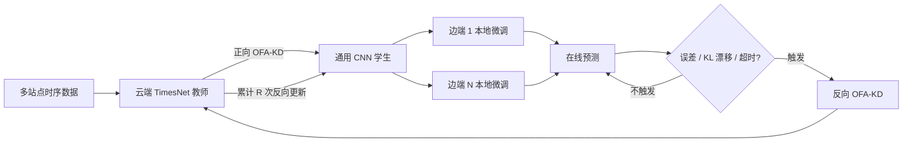

# CE-BiD：云边协同双向蒸馏时序预测

[English](README.md) · [复现说明](docs/REPRODUCIBILITY.md)

CE-BiD 面向光伏发电与充电负荷的在线预测场景：云端使用容量较大的 **TimesNet** 学习多站点全局时序规律，边端部署轻量 **1D-CNN** 完成本地低成本推理；通过面向回归任务改造的 **One-for-All 知识蒸馏（OFA-KD）**实现云到边、边到云的双向知识传递，并通过误差、分布漂移和超时三类条件按需触发更新。

项目基于 [THUML Time-Series-Library](https://github.com/thuml/Time-Series-Library) 改造。云边流程、轻量 CNN、正向/反向蒸馏、OFA 回归损失、事件触发模拟器及实验脚本是本项目的主要扩展。

## 技术流程



完整闭环由四步组成：

1. 在合并后的多站点数据上训练 TimesNet 云端教师。
2. 用真实标签、教师软目标和可选的多阶段 OFA 投影器，把知识蒸馏到通用 CNN。
3. 将通用 CNN 复制到各站点，用本站近期数据做个性化微调。
4. 在线模拟中仅在预测性能下降、直方图 KL 漂移或长时间未更新时执行反向蒸馏；累计若干次反向更新后，再刷新边端模型。

## 已有实验结果

下表来自项目保留的真实实验报告和论文草稿，并非本次整理时重新运行得到。

| 数据集 | 方法 | MAE ↓ | MSE ↓ | RMSE ↓ | R² ↑ | Corr ↑ |
|---|---|---:|---:|---:|---:|---:|
| PVOD | MSE 最优基线 TimeXer | 0.2735 | 0.2786 | 0.5279 | 0.8424 | 0.9186 |
| PVOD | **CE-BiD** | 0.3027 | **0.2701** | **0.5190** | **0.8472** | **0.9204** |
| ST-EVCDP | MSE 最优基线 TimeXer | 0.3025 | 0.2986 | 0.5464 | 0.7598 | 0.8723 |
| ST-EVCDP | **CE-BiD** | **0.2863** | **0.2506** | **0.5001** | **0.7864** | **0.8867** |

相对 MSE 最优基线，论文记录的 MSE 降幅为：PVOD **3.05%**、ST-EVCDP **16.08%**。需要如实说明：PVOD 上 TimeXer 的 MAE 更低，CE-BiD 在其余四项指标上更好。完整基线和消融数值见 [`docs/results`](docs/results)。

保留的 PVOD 在线实验包含 167 个推理步、32 次更新，更新率 19.2%；其中误差触发 9 次、漂移触发 5 次、超时触发 18 次。各边端总体平均为 MSE 0.2701、MAE 0.3027、R² 0.8472、Corr 0.9204。

## 目录说明

```text
data_provider/     CSV 校验、时序划分与归一化
exp/               训练、正向蒸馏、本地微调、反向蒸馏、在线模拟
layers/             TimesNet 基础层、OFA 回归投影器与中间层 hook
models/            云端 TimesNet 与边端轻量 CNN
scripts/PVOD/      PVOD 三阶段初始化脚本
*.sh               在线模拟、消融与敏感性实验脚本
docs/              复现说明及整理后的结果
tests/             模型形状、数据边界和 OFA 损失测试
```

数据集、checkpoint、原始预测数组和生成图片体积较大，因此不进入 Git。

## 快速开始

报告实验环境为 Python 3.8.20、PyTorch 1.7.1。完整训练建议使用 GPU，小规模检查可以自动回退到 CPU。

```bash
conda env create -f environment.yml
conda activate ce-bid
python -m unittest discover -s tests -v
```

按 [`dataset/README.md`](dataset/README.md) 下载并放置 PVOD 或 ST-EVCDP；初始化脚本会在 `dataset/processed/` 生成时间戳对齐副本。七站点 PVOD 配置中，边端数值维度为 15，云端维度为 99，并满足：

```text
cloud_dim = 站点数 × (edge_dim - 1) + 1
          = 7 × (15 - 1) + 1 = 99
```

Linux 或 WSL 下可执行：

```bash
CUDA_VISIBLE_DEVICES=0 bash scripts/PVOD/Init.sh
CUDA_VISIBLE_DEVICES=0 N_PARTY=7 EDGE_DIM=15 bash real_time.sh
```

初始化脚本会生成本仓库未包含的 checkpoint；维度、数据文件或 checkpoint 不一致时，代码会尽早报错。逐阶段命令和复现注意事项见 [`docs/REPRODUCIBILITY.md`](docs/REPRODUCIBILITY.md)。

## 使用边界

- 当前是“在线流程的离线模拟器”，不是已经部署的真实分布式平台。
- 本项目不是联邦学习，也没有提供形式化隐私保证；模拟器可以访问本地 party 文件，触发更新时也可能使用本地数据。
- KL 漂移检测是工程化直方图启发式规则，不是严格的统计假设检验。
- 复现实验需要一致的数据处理、划分、随机种子和超参数；仓库不包含 checkpoint，不能只靠推理恢复论文数值。
- 公开整理版修正了历史源码中的 scaler、checkpoint 导出、触发隔离和蒸馏目标等问题，详见[复现说明](docs/REPRODUCIBILITY.md)；保留的历史表格尚未在修正后重新生成。
- 当前流程假设云边连接基本稳定，尚未实验验证弱网通信开销与鲁棒性。

## 致谢与许可

本项目基于 [Time-Series-Library](https://github.com/thuml/Time-Series-Library)，并将 [OFA-KD](https://github.com/Hao840/OFAKD) 的思想适配到回归预测。归属说明见 [`NOTICE`](NOTICE)。代码采用 [`MIT License`](LICENSE)，数据集仍遵循各自发布方许可。
